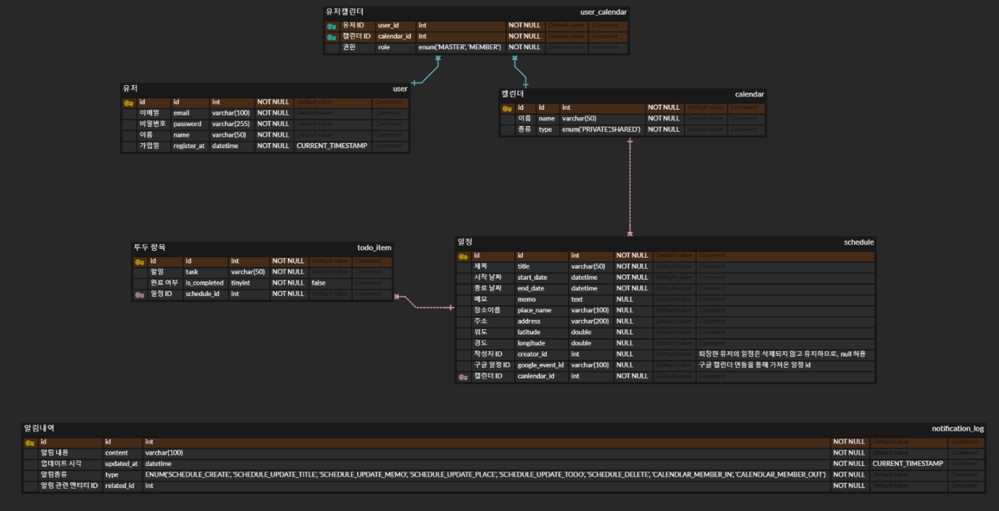

# 📅 Timate 일정 관리 및 공유 서비스

## 프로젝트 소개

Timate는 "Time + Mate" 의 조합으로, 개인 일정 관리와 가족, 친구 또는 팀과의 일정 공유를 통해 소통할 수 있는 캘린더 기반의 서비스입니다. 
푸시 알림, Kakao Map API 연동, Google Calendar API 연동, WebSocket과 Redis Pub/Sub을 활용한 실시간 업데이트 등 다양한 기능을 통해 원활한 일정 관리 경험을 제공합니다.

---

## 기능

### 1. 회원 관리
- 이메일 인증을 통한 회원가입
- 로그인 및 로그아웃
- 기본 정보 조회
- 회원 탈퇴

### 2. 캘린더 생성
- **다수의 캘린더 생성:** 개인용, 공유용 등 여러 개의 캘린더를 생성하여 관리 가능.
- **캘린더 멤버 관리:** 각 캘린더 별로 멤버 관리 가능.

### 3. 캘린더 멤버 초대
- 선택된 캘린더를 공유하여 같이 관리할 멤버를 초대
- 초대 링크 생성하여 멤버에게 공유

### 4. 캘린더 나가기 및 삭제
- **생성자 권한 양도:** 생성자가 캘린더를 나갈 때, 다른 멤버에게 생성자 권한을 양도할 수 있음.
- **생성자만 남은 경우 캘린더 삭제:** 만약 생성자만 남아 있는 경우, 캘린더는 삭제됨.
- **캘린더 나가도 일정은 남음:** 퇴장하는 멤버가 작성한 일정은 삭제되지 않고 그대로 남음.
- **캘린더 삭제:** 생성자만 가능

### 5. 일정 관리
  - 시작일/종료일
  - 투두 리스트
  - 메모
  - 장소
    - 일정에 장소를 추가할 때, Kakao Local API의 "키워드로 장소 검색" 기능을 사용하여 키워드로 장소를 검색하고 해당 장소를 일정에 추가함.
    - [Kakao Local API 문서](https://developers.kakao.com/docs/latest/ko/local/dev-guide#search-by-keyword-request-query)에서 제공하는 API를 사용.
   
### 6. 알림 목록
- 일정에 변화가 있을 때 (예: 일정 추가/변경, 참가자 추가 등) 변경된 내용과 해당 일정에 관련된 멤버들을 알림으로 표시

### 7. 푸시 알림
- FCM을 활용하여 아래와 같은 상황에 푸쉬 알림 전송
  - 초대한 멤버가 초대를 승인한 경우
  - 멤버가 일정을 등록/수정한 경우

### 8. 실시간 업데이트
- **WebSocket + Redis Pub/Sub:** 일정 추가/수정 시 실시간으로 반영되도록 구현.

### 9. 구글 캘린더 API 연동
- **구글 캘린더 API:** 외부 캘린더에서 구글 캘린더의 일정을 가져오기.

---

## 개발 환경

- **IDE:** IntelliJ IDEA
- **데이터베이스:** MariaDB 10.6.20
- **백엔드:** Spring Boot 3.4.2
- **언어:** Java 17

---

## 사용 기술

- **푸시 알림:** FCM (Firebase Cloud Messaging)
- **실시간 통신:** WebSocket + Redis Pub/Sub
- **외부 API:** Kakao Local API, Google Calendar API

---
## 개발 가이드
- [트러블슈팅 가이드](docs/troubleshooting.md)

---

## ERD (Entity Relationship Diagram)

아래는 데이터베이스 구조를 나타내는 ERD입니다. 이 다이어그램은 각 엔티티 간의 관계를 설명합니다.

